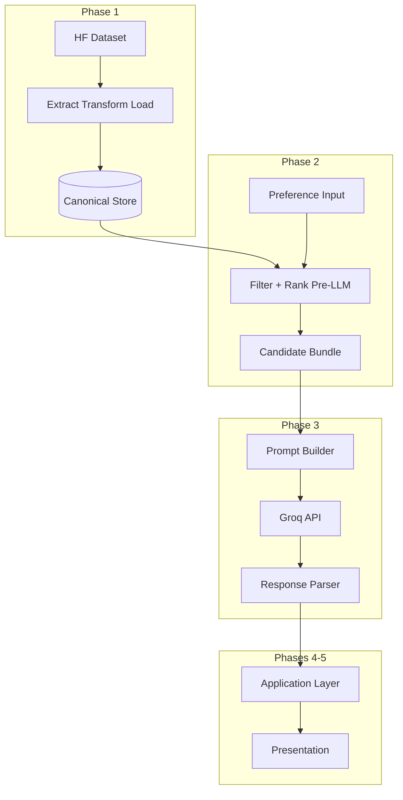

# Phase-Wise Architecture: AI-Powered Restaurant Recommendation System

This document expands the [problem statement](./problemstatement.md) into a detailed, phased architecture. Each phase lists purpose, components, interfaces, data contracts, operational concerns, deliverables, and verification criteria.

**Primary dataset:** [ManikaSaini/zomato-restaurant-recommendation](https://huggingface.co/datasets/ManikaSaini/zomato-restaurant-recommendation) (Hugging Face).

**High-level principle:** Deterministic filtering narrows the universe of restaurants to a **bounded candidate set**; the LLM **only ranks and explains** candidates that exist in that set—never inventing new venues.

**Phase 3 LLM:** Recommendations use the **[Groq](https://groq.com/) Inference API** (Groq-hosted models). The Groq API key is **never committed**: it belongs in a local **`.env`** file at the repository root (mirrored by **`.env.example`** with placeholder names only). Implementations load it as an environment variable—for example **`GROQ_API_KEY`** loaded from `.env` via [`python-dotenv`](https://pypi.org/project/python-dotenv/) in development, or injected by the host in production.

---

## Document map

| Phase | Focus |
|-------|--------|
| [Phase 0](#phase-0--foundations-and-non-functional-baseline) | Foundations, NFRs, repository layout |
| [Phase 1](#phase-1--data-ingestion-and-canonical-model) | Ingestion, normalization, storage |
| [Phase 2](#phase-2--preference-contract-and-deterministic-filtering) | User preferences, filter engine, candidates |
| [Phase 3](#phase-3--llm-orchestration-and-recommendation-engine) | Prompting, LLM call, parsing, fallback |
| [Phase 4](#phase-4--application-service-layer) | API/CLI, configuration, cross-cutting concerns |
| [Phase 5](#phase-5--presentation-and-output-display) | UI/UX, response mapping |
| [Phase 6](#phase-6--hardening-evaluation-and-operations) | Testing, cost, safety, iteration |

---

## Cross-phase reference architecture



---

## Phase 0 — Foundations and non-functional baseline

### Purpose

Establish constraints, technology choices, security posture, and repository structure so later phases do not rework fundamentals.

### Detailed components

| Area | Detail |
|------|--------|
| **Runtime** | Pick primary language (e.g. Python for HF/`datasets` + FastAPI, or split: Python data pipeline + Node API). Document Python version or Node LTS. |
| **Secrets** | **Groq:** `GROQ_API_KEY` in **`.env`** (root); never committed. Optional Hugging Face `HF_TOKEN` the same way. `.env.example` documents variable **names only**—no live keys. |
| **Configuration** | Central config: **Groq model id** (e.g. environment-specific default), `MAX_CANDIDATES`, Groq timeouts / `max_tokens`, dataset revision/split, optional default locations. |
| **Repository layout** (suggested) | `docs/` — problem statement and this architecture; `data/` — raw/processed artifacts (gitignored if large); `src/` or `app/` — ingestion, filtering, LLM, API; `tests/` — unit and integration; `scripts/` — one-off maintenance. |
| **Observability baseline** | Structured logging format (JSON or key=value), correlation ID per request, log levels. |
| **LLM strategy** | **Groq Inference API only** for Phase 3 (fast hosted inference); document latency and usage limits per recommendation request. No local heavyweight model assumed for MVP. |

### Interfaces (conceptual)

- **Configuration schema:** Typed object or validated dict (e.g. Pydantic settings, `zod`, or twelve-factor env parsing).

### Non-functional requirements (baseline targets)

| Concern | Typical MVP target |
|---------|-------------------|
| Latency | End-to-end recommendation under 10–30 s depending on LLM (document actual SLA). |
| Determinism | Same preferences + same dataset snapshot → same filtered candidate list. |
| Correctness | LLM output references only IDs/names present in candidate bundle (validated in Phase 3). |

### Deliverables

- Documented stack choice and folder layout.
- `.env.example` and configuration loading pattern.
- Definition of “dataset snapshot” (HF revision hash or dated export).

### Verification

- New developer can clone repo, set env from example, and run a documented “health” command (even if it only loads config).

---

## Phase 1 — Data ingestion and canonical model

### Purpose

Map the Hugging Face Zomato dataset into a **stable, query-friendly canonical schema** suitable for filtering and for injection into LLM prompts.

### Detailed workflow

1. **Acquire:** Load dataset via `datasets` library or equivalent; pin revision (`revision=` or snapshot date) for reproducibility.
2. **Inspect:** Print or document raw column names and sample rows; map each raw column to canonical fields (handle renames across dataset versions).
3. **Transform:**
   - Normalize text: trim, collapse whitespace, consistent casing for matching (e.g. city).
   - Parse multi-value fields (e.g. comma-separated cuisines) into arrays.
   - Coerce numerics: ratings to float; cost fields to numeric or enumerated bucket.
   - Handle nulls: explicit `unknown` vs drop rows (document policy per field).
4. **Enrich (optional):** Derive `budget_band` from numeric cost if raw data supports it; derive simple tags from reviews/text only if present and scoped.
5. **Persist:** Write processed table(s) to chosen store (see below).

### Canonical restaurant record (illustrative contract)

Fields align with the problem statement; exact names may vary by implementation.

| Field | Type | Notes |
|-------|------|--------|
| `restaurant_id` | string or int | Stable primary key (synthetic if missing). |
| `name` | string | Display name. |
| `city` / `location` | string | Match user “location” (e.g. Delhi). Define whether locality is separate. |
| `cuisines` | string[] | Normalized tokens for filter + display. |
| `aggregate_rating` | float \| null | Map from dataset “rating” column. |
| `cost_for_two` or `avg_cost` | number \| null | Or categorical cost proxy. |
| `budget_band` | enum | `low` \| `medium` \| `high` — mapped from cost using project-defined thresholds. |
| `additional_signals` | object (optional) | e.g. short text snippet for LLM context only if grounded in data. |

### Storage options (choose one for MVP)

| Option | When to use |
|--------|-------------|
| **Parquet file(s)** | Simple, fast analytics; good with Polars/Pandas. |
| **SQLite** | Single-file DB; SQL filters; easy deployment. |
| **Postgres** | Multi-user, concurrent API, future analytics. |

### Interfaces

- **Ingestion CLI/API:** `ingest [--revision HASH]` → writes artifact path and row counts.
- **Data access layer:** Read-only functions `load_restaurants()`, `get_schema_version()`.

### Operational concerns

- **Idempotency:** Re-running ingestion overwrites or versions outputs consistently.
- **Size:** If full dataset is large, support column pruning at load time to reduce memory.

### Deliverables

- Ingestion script/module and documented canonical schema.
- Sample query proving filters can run against the store.
- Data README: column mapping from HF dataset → canonical fields.

### Verification

- Row count and null-rate report after ingest.
- At least one automated test: ingest fixture subset → expected schema keys.

---

## Phase 2 — Preference contract and deterministic filtering

### Purpose

Convert user-facing preferences into a **structured preference object**, apply **deterministic filters**, and emit a **candidate bundle** (bounded list) for the LLM.

### User preference contract (input model)

| Field | Type | Validation |
|-------|------|------------|
| `location` | string | Required or default; fuzzy match policy documented (exact city vs substring). |
| `budget` | enum | `low` \| `medium` \| `high`; maps to `budget_band` or cost ranges. |
| `cuisine` | string \| string[] | At least one cuisine token; OR semantics across multiple cuisines. |
| `min_rating` | float | e.g. 3.0–5.0; restaurants below excluded unless null policy says otherwise. |
| `additional_preferences` | string (optional) | Free text (e.g. “family-friendly”); used in **filter heuristics** if rules exist, else passed only to LLM as soft constraints. |

### Filter engine (detailed behavior)

1. **Hard filters (SQL/DataFrame):**
   - Location: equality or normalized contains on city field.
   - Rating: `rating >= min_rating` OR exclude null ratings based on policy.
   - Cuisine: overlap between user cuisine(s) and `cuisines` array (case-insensitive).
   - Budget: match `budget_band` or cost interval derived from enumerations.

2. **Pre-ranking (deterministic):** Sort filtered rows by composite score, e.g. higher rating first, then closer cost fit to budget band—document formula.

3. **Cap:** Take top `MAX_CANDIDATES` (e.g. 20–40). This caps tokens and cost for Phase 3.

### Candidate bundle (output of Phase 2 → input of Phase 3)

Structured payload passed to the prompt builder:

- `preferences`: Echo normalized preferences for LLM context.
- `candidates`: Ordered list of `{ restaurant_id, name, city, cuisines, rating, estimated_cost_display, budget_band }`.
- `metadata`: `filter_count`, `returned_count`, `dataset_snapshot_id`.

### Interfaces

- **Pure function:** `filter_restaurants(preferences: PreferenceDTO, store: DataAccess) -> CandidateBundle`
- **Validation layer:** Reject invalid enums/ratings before DB access; return 400-style errors at HTTP layer in Phase 4.

### Edge cases

| Case | Behavior |
|------|----------|
| Zero matches | Return empty bundle; Phase 3 skipped or returns helpful message; UI shows “relax filters”. |
| Too many matches | Cap handles; optional diversity slice (e.g. max per cuisine) if required later. |
| Missing ratings | Policy: exclude vs treat as lowest—document choice. |

### Deliverables

- `PreferenceDTO` + validation.
- Filter implementation + unit tests for location/cuisine/budget/rating combinations.

### Verification

- Golden tests: fixed preferences on small fixture DB → exact candidate IDs and order (pre-LLM).

---

## Phase 3 — LLM orchestration and recommendation engine

### Purpose

Use the LLM to **rank**, **explain**, and optionally **summarize** among **only** the supplied candidates, producing structured recommendations for the UI.

### LLM provider: Groq

| Topic | Decision |
|-------|-----------|
| **Service** | [Groq API](https://console.groq.com/) (OpenAI-compatible chat/completions endpoints where applicable). |
| **Credential** | `GROQ_API_KEY`, read from the process environment after loading **`.env`** in dev (`.env` remains gitignored). |
| **Config surface** | Model name (Groq model id), temperature, `max_tokens`, and request timeout as env vars or Pydantic settings—defaults suitable for JSON-structured replies. |
| **Failure modes** | Same as generic Phase 3: timeouts, malformed JSON, or empty completion → deterministic fallback rankings + template explanations. |

### Prompt design (layers)

1. **System message:** Role (“expert dining assistant”), constraints (“only recommend restaurants from the provided list”, “use restaurant_id for reference”, “if unsure, say data is insufficient”).
2. **User/developer content:** JSON or markdown table of candidates with IDs; normalized user preferences including `additional_preferences`.
3. **Output contract:** Request JSON array of top K items: `restaurant_id`, `rank`, `explanation`, optional `summary` field at root.

### Detailed pipeline steps

1. **Prompt builder:** Serialize `CandidateBundle` + preferences → single prompt string or structured chat messages.
2. **LLM invocation:** Call **Groq** with the configured model id (using `GROQ_API_KEY`); temperature low–medium for consistency; set `max_tokens`; timeout aligned with Phase 0 NFRs. Prefer JSON-schema-friendly prompts or constrained output when the SDK supports it.
3. **Parser:** Extract JSON (or use provider JSON mode); validate each `restaurant_id` exists in candidate list.
4. **Sanitizer:** Drop hallucinated IDs; back-fill order from deterministic ranking if LLM omits items.
5. **Fallback path:** On timeout/parse failure → return top K candidates by Phase 2 order with **template explanations** (“High rating and matches your cuisine and budget.”).

### Recommendation record (output contract for Phase 4/5)

| Field | Source |
|-------|--------|
| `restaurant_id` | Must match candidate |
| `name`, `cuisine`, `rating`, `estimated_cost` | Prefer **store-backed** fields after join by ID (avoid trusting LLM for numbers) |
| `explanation` | LLM text |
| `rank` | LLM order merged with validation |

### Interfaces

- `recommend(bundle: CandidateBundle, preferences: PreferenceDTO) -> RecommendationResult`
- `RecommendationResult`: `{ items: RecommendationItem[], summary?: string, used_llm: boolean, warnings: string[] }`

### Operational concerns

| Concern | Mitigation |
|---------|------------|
| Token cost | Strict candidate cap; concise candidate serialization. |
| Latency | Streaming optional for UX; async job only if product needs it. |
| Quality drift | Version prompts in repo; snapshot outputs for regression samples. |

### Deliverables

- Prompt templates (versioned strings or files).
- Parser + validator + fallback implementation.
- Integration test with mocked LLM returning valid JSON.

### Verification

- Validator rejects fabricated `restaurant_id`.
- Fallback tested when LLM returns malformed output.

---

## Phase 4 — Application service layer

**Status: implemented (backend).** Code: `src/restaurant_rec/phase4/` (`service.py`, `api.py`, `schemas.py`). Tests: `tests/test_phase4_api.py`.

### Purpose

Expose the pipeline as a **service** (HTTP API and/or CLI): orchestrate validation → filter → LLM → join display fields, with consistent errors and observability.

### API surface (REST)

| Method | Path | Body | Response |
|--------|------|------|----------|
| `GET` | `/health` | — | `{ status, dataset, schema_version, dataset_snapshot_id, row_count, prompt_version }` |
| `GET` | `/v1/localities` | — | Sorted unique cities from the ingested store |
| `POST` | `/v1/recommend` | JSON PreferenceDTO (`locality` or `location`, `budget`, `cuisine`, `min_rating`, optional `additional_preferences`) | `RecommendResponse` (items + `filter_count`, `returned_count`, `used_llm`, `warnings`, optional `message`) |

Error model: `422` validation, `503` dataset not loaded, `400` business rule errors, `500` unexpected.

**Run locally:**

```powershell
python -m restaurant_rec ingest
python -m restaurant_rec serve
# or: uvicorn restaurant_rec.phase4.api:app --host 0.0.0.0 --port 8000
```

**Example:**

```powershell
curl http://127.0.0.1:8000/health
curl -X POST http://127.0.0.1:8000/v1/recommend -H "Content-Type: application/json" -d "{\"location\":\"Delhi\",\"budget\":\"medium\",\"cuisine\":[\"North Indian\"],\"min_rating\":4.0}"
```

### Orchestration sequence

1. Validate and normalize input.
2. Load data access (or connection pool).
3. Run Phase 2 filter → candidate bundle.
4. If candidates empty → short-circuit response with message.
5. Run Phase 3 recommend.
6. **Join:** For each item, attach authoritative `rating`, `cost`, `cuisine` from store by `restaurant_id`.
7. Log: timing per stage, candidate count, LLM success flag (no raw secrets).

### Cross-cutting concerns

| Concern | Implementation hint |
|---------|----------------------|
| **Rate limiting** | Per IP or API key if public. |
| **CORS** | Configure if SPA frontend separate origin. |
| **Dependency injection** | Swap LLM client for tests. |

### Deliverables

- [x] `RecommendationService` orchestration with stage timing logs and store join.
- [x] FastAPI app (`restaurant_rec.phase4.api`) with CORS and injectable LLM for tests.
- [x] CLI: `python -m restaurant_rec serve` (and `restaurant-api` entrypoint).
- [x] OpenAPI at `/docs` when the server is running.

### Verification

- [x] `tests/test_phase4_api.py`: health, successful recommend (mocked LLM), invalid input (422).

---

## Phase 5 — Presentation and output display

**Status: implemented.** **Next.js** app in `frontend-next/` (Zomato AI mockup layout, Tailwind) — run with `npm run dev` on port 3000. Legacy static UI in `frontend/` is still served at `/` by FastAPI when using `serve` alone. Both call `/health`, `/v1/localities`, and `/v1/recommend`.

### Purpose

Present **top recommendations** in a clear, user-friendly format matching the problem statement.

### Required display fields (per row)

- Restaurant name  
- Cuisine  
- Rating  
- Estimated cost  
- AI-generated explanation  

### UI architecture options

| Approach | Notes |
|----------|--------|
| **Frontend Website (Selected)** | We will implement a rich frontend website (e.g., React/Vue or Vanilla JS SPA) calling `/v1/recommend`, complete with loading and error states. |
| **CLI** | Table output for demos or grading (deprecated in favor of website). |

### UX behaviors

- Loading indicator during LLM call.
- Empty state when no candidates.
- Optional disclosure: “Suggestions are based on dataset X and an AI model; verify details before visiting.”
- Accessibility: readable contrast, semantic headings, keyboard focus for interactive elements.

### Mapping from API response

- Prefer numeric/string fields from **backend join** (Phase 4), not free-text from LLM, for rating and cost.
- Explanation from LLM rendered as prose under each card/row.

### Deliverables

- [x] `frontend/index.html`, `app.js`, `style.css` — form, loading state, results cards, errors, API status.
- [x] Mounted via `StaticFiles` in `phase4/api.py` (same-origin, no CORS setup needed for local E2E).

### Verification

- Manual E2E: `serve` → open `http://127.0.0.1:8000/` → submit preferences → see name, cuisine, rating, cost, explanation per card.

---

## Phase 6 — Hardening, evaluation, and operations

### Purpose

Improve reliability, measure quality, control cost, and prepare for ongoing dataset or model updates.

### Testing pyramid

| Layer | Scope |
|-------|--------|
| Unit | Filters, budget mapping, parsers, validators. |
| Integration | Ingest fixture → filter → mock LLM → API response. |
| E2E | Optional Playwright/Cypress against staging. |

### Evaluation (qualitative + light quantitative)

- Curated **preference scenarios** (e.g. “Bangalore, medium budget, Italian, min 4.0”) with human-reviewed acceptable top 3.
- Track **hallucination rate**: invalid IDs in raw LLM output before sanitizer (should trend to zero after validation).

### Cost and performance

- Dashboard or logs: p50/p95 latency, tokens per request.
- Tune `MAX_CANDIDATES`, prompt length, model tier.

### Safety and privacy

- Treat `additional_preferences` as user content; avoid reflecting unsanitized input in logs.
- Optional content moderation on free-text if exposed publicly.

### Operations

- Procedure to refresh dataset (re-run Phase 1, restart or hot-reload).
- Version tagging: app version + dataset snapshot + prompt version in `/health` or response headers.

### Deliverables

- Test suite coverage on critical paths.
- Short runbook: deploy, rotate keys, refresh data.

### Verification

- CI runs tests on push.
- Documented rollback if new dataset breaks schema.

---

## Phase dependency summary

| Phase | Depends on |
|-------|------------|
| 0 | — |
| 1 | 0 |
| 2 | 1 |
| 3 | 2 |
| 4 | 2, 3 |
| 5 | 4 |
| 6 | All prior |

---

## Traceability to original workflow

| Problem statement step | Primary phase(s) |
|------------------------|------------------|
| 1. Data ingestion | Phase 1 |
| 2. User input | Phase 2 (contract), Phase 5 (collection) |
| 3. Integration layer | Phases 2–3 |
| 4. Recommendation engine | Phase 3 |
| 5. Output display | Phase 5 |

---

## Deployment Strategy

- **Backend**: The application's backend API and logic will be deployed using **Streamlit**.
- **Frontend**: The frontend user interface will be deployed and hosted on **Vercel**.

---

*Document version: 1.3 — Phase 5 basic UI implemented for E2E testing.*
